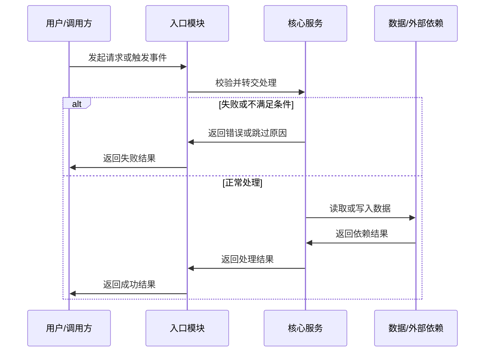

# MR 审核检查清单

按需读取本文件。它用于把候选问题压实成可行动的审核发现，不用于机械地产生清单式噪音。

## 判断标准

- 只报告会影响正确性、安全、数据、兼容性、可运维性或验证可信度的问题。
- 审核必须基于 Review Package；如果 diff、规格、目标基线、源分支头部或测试证据缺失到影响判断，返回 `NEEDS_CONTEXT`，不要硬给通过结论。
- 每条发现必须能回答：什么输入或状态会触发、实际行为是什么、期望行为是什么、为什么当前 MR 引入或暴露了它。
- 能用一两行代码修复的问题，建议要给到具体方向；需要产品或架构决策的问题，写清阻塞点和需要谁确认。
- 对已有评论已覆盖的问题，只在用户要求复核时引用，不重复评论。
- 如果目标分支基线的 `AGENT.md` 明确了架构边界、目录职责、测试策略或禁用模式，违反这些约定且会影响维护或正确性时可以作为审核发现。源分支修改指南文件时，先审查规则变化是否合理，再决定是否采纳新规则。
- 如果 `specs/` 文件明确了验收条件，MR 未实现、实现偏离或引入规格外副作用时，应按影响程度报告；没有对应 specs 规格文件时不要把“缺 specs 规格文件”本身当作阻塞问题。

## 高风险区域

- 鉴权和权限：越权访问、租户隔离、角色判断、默认允许、缓存权限过期。
- 数据写入：事务边界、幂等性、重复提交、部分失败、字段默认值、软删除和状态流转。
- 兼容性：API 响应字段变化、数据库迁移、配置缺省值、老数据读写、灰度发布。
- 并发和时序：竞态、锁粒度、异步任务重复消费、事件顺序、重试副作用。
- 安全：注入、路径遍历、敏感日志、明文密钥、SSRF、XSS、CSRF、开放重定向。
- 错误处理：吞错、错误码误导、降级路径、超时、外部依赖失败后的状态一致性。
- 观测与回滚：关键失败无日志、指标缺失、无法定位请求、迁移不可回滚。
- 前端交互：权限态和服务端不一致、加载/空态/错误态缺失、表单重复提交、数据刷新错误。

## 测试判断

- MR 审核不运行任何本地测试命令、云效流水线、测试计划或测试用例；只读取已有测试证据并判断风险。
- 有新分支逻辑时，至少应有覆盖新增分支的单元或集成测试，除非风险很低且已有测试直接覆盖。
- 修复 bug 的 MR 应优先补回归测试；无法补测试时，说明手工验证步骤和残余风险。
- 只改类型、文案或日志时，不强行要求测试，但要确认不会改变外部契约。
- 迁移、权限、支付、数据修复、发布配置类 MR，要重点检查验证证据，不因“代码看起来对”就放过。

## 行内评论写法

```markdown
**`P1` 问题标题**

- **触发条件**：说明什么输入、状态或调用路径会触发。
- **问题原因**：说明当前 diff 中哪段逻辑导致问题。
- **影响范围**：说明会影响哪些用户、数据、权限或流程。
- **修复建议**：给出最小修复方向。
- **验证建议**：说明应补充或复核的关键场景；没有测试缺口时写“复用现有验证即可”。
```

`INLINE_COMMENT` 用于能可靠定位到当前 diff 新增或修改行的问题，内容要短，目标长度控制在 1200 字符内，避免塞入整段审核报告。问题类 `GLOBAL_COMMENT` 用于总体风险、多个文件共同导致的问题、无法可靠定位到单行的问题；最终总结 `GLOBAL_COMMENT` 单独发布，不承载未解决问题详情。

## 全局问题评论写法

```markdown
### `P1` 问题标题

- **位置**：`path/to/file.ts:42`、`path/to/other.ts`；跨模块问题写主要相关文件。
- **触发条件**：说明什么输入、状态或调用路径会触发。
- **问题原因**：说明涉及的代码路径、状态变化或模块协作问题。
- **影响范围**：说明会影响哪些用户、数据、权限或流程。
- **修复建议**：给出最小修复方向；需要产品或架构确认时写清确认点。
- **验证建议**：说明需要补充或复核的关键场景。
```

问题类 `GLOBAL_COMMENT` 不能包含 `<!-- yunxiao-mr-reviewer:final-summary -->` 标记，也不要把多个无关问题塞进同一条评论。

## 复核已有评论

- 评论已解决但代码没有变化时，不能直接认定已修复；要用最新 patch set 或文件内容验证。
- 用户要求“看还有哪些未处理”时，先列未解决评论，再判断是否仍然成立。
- 用户要求“帮我回复评论”时，先理解评论上下文和当前代码状态；允许直接调用 `create_change_request_comment` 或 `update_change_request_comment` 回复或更新 MR 评论，不需要二次确认。

## 最终总结评论写法

- 总结评论要服务人工 review：先讲“这个分支做了什么”，再讲“怎么实现”，最后讲“应该重点看哪里”。
- 总结评论固定是 `GLOBAL_COMMENT`，不能写成 `INLINE_COMMENT`，也不能和问题类 `GLOBAL_COMMENT` 混在同一条里。
- 总结评论按 Markdown 编写，用 `##` 标题组织主要章节，用列表承载重点，不要用大段纯文本堆叠。
- 可以借鉴 AI review 报告的分组方式，但要落成普通 Markdown 章节：`评审意见` 分为 `代码实现建议` 和 `架构设计建议`，`审查详情` 记录文件清单和证据范围。
- 问题评论不使用 Mermaid、HTML、表格、脚注、折叠块或装饰性分隔线；最终总结评论允许使用符合本 skill 模板的 Mermaid `sequenceDiagram` 代码理解图。
- `实现流程` 使用有序列表描述“入口、处理、输出、异常路径”；只知道模块关系时，写模块级流程并说明依据。
- `代码理解图` 使用 Mermaid `sequenceDiagram` 代码块，代码块第一行写 <code>```mermaid</code>，第二行写 `sequenceDiagram`；用 `participant X as 名称` 声明参与者，用 `A->>B: 动作说明` 表达调用或状态推进，用 `alt` / `else` / `end` 表达关键分支。即使代码更像流程图，也用时序图表达，除非用户提供云效可显示的流程图样例。
- 不把每个文件逐行复述成流水账；按能力、入口、持久化、外部依赖、测试分组说明。
- 不把行内问题评论完整复制到总结里；总结只列问题索引、数量和人工复核重点。
- 总结评论必须带 `<!-- yunxiao-mr-reviewer:final-summary -->` 标记，并显式设置 `resolved=false`；过长时压缩到模块级摘要，不牺牲人工 review 重点。
- 总结评论必须给出 `APPROVED` / `NEEDS_CHANGES` / `NEEDS_CONTEXT` 之一；存在 `P0` 或 `P1` 时不能给 `APPROVED`。

推荐结构：

````markdown
<!-- yunxiao-mr-reviewer:final-summary -->

## AI Review 最终总结

### 1. 变更概览

- **结论**：一句话说明这个分支解决什么问题。
- **主要模块**：列出模块或能力分组。
- **关键文件**：列出 3 到 8 个最值得人工 review 的文件；过多时按模块概括。

### 2. 项目约定依据

- **已读取**：列出 `AGENT.md` 路径；没有则写“未发现项目 AGENT 指南”。
- **影响本次审核的约定**：列出和本 MR 直接相关的约定。

### 3. 规格对应关系

- **已读取**：列出 `specs/` 文件、工作项或 MR 描述来源。
- **覆盖情况**：说明已覆盖的需求点。
- **未覆盖/未确认**：说明缺失的 specs 规格文件、验收点或业务确认项。

### 4. 评审意见

- **代码实现建议**：列出明确的代码实现问题或写“未发现需要特别关注的代码实现问题”。
- **架构设计建议**：列出跨文件交互、系统一致性、边界抽象、配置契约或扩展性风险；没有则写“未发现需要特别关注的架构设计问题”。
- **关键代码**：列出 0 到 5 个最需要人工看的文件行号链接；已在问题评论中覆盖时写“见问题评论”。
- **潜在风险**：只写由 diff、specs 规格文件或现有证据支持的风险；没有则写“未发现明显潜在风险”。

### 5. 实现流程

1. **入口**：说明请求、任务、命令或事件从哪里进入。
2. **处理**：说明主要判断、转换、调用或状态流转。
3. **输出**：说明最终响应、持久化、消息投递或外部副作用。
4. **异常路径**：说明失败、空数据、权限不足或兼容分支；没有则写“未发现特殊异常路径”。

### 6. 代码理解图



### 7. 核心实现说明

- **模块/文件**：说明新增或修改的职责、关键分支和边界处理。

### 8. 测试与验证

- **已有证据**：列出 MR 描述、测试文件、流水线结果或人工验证说明。
- **缺口**：列出和风险直接相关的缺口；没有则写“未发现明显测试缺口”。
- **AI 执行情况**：AI 未执行本地测试、云效流水线或测试计划，仅基于已有证据审核。

### 9. 人工 review 重点

- **重点 1**：说明文件或流程，以及人工需要确认的原因。

### 10. 审查详情

- **变更文件**：列出文件总数和主要路径；文件很多时按目录或模块归类。
- **已审查材料**：列出 MR 描述、diff、提交、`AGENT.md`、`specs/`、工作项、已有评论等实际读取的材料。
- **未审查/受限**：列出权限不足、文件过大、未取得 specs 规格文件、无法读取旧版本等限制；没有则写“未发现受限材料”。

### 11. AI 审核结论

- **结论**：`APPROVED` / `NEEDS_CHANGES` / `NEEDS_CONTEXT`
- **问题评论**：已写入 `P0/P1/P2/P3` 评论数量；没有则写“未写入问题评论”。
- **残余风险**：一句话说明剩余风险或上下文缺口；没有则写“未发现需要阻塞合并的残余风险”。
````
